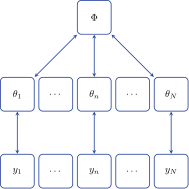
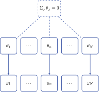

```{r, include=FALSE, cache=FALSE}
cmdstanr::register_knitr_engine(override = TRUE)
options(mc.cores = parallel::detectCores())

# For PDF output, draw the Spectral font (shipped in fonts/) via showtext,
# since the PDF graphics devices can't see project-local fonts.
if (knitr::is_latex_output()) {
  sysfonts::font_add("Spectral", "fonts/Spectral-Regular.ttf")
  showtext::showtext_auto()
  knitr::opts_chunk$set(fig.showtext = TRUE)
}

Sys.setenv(LIBGS = "/opt/homebrew/opt/ghostscript/lib/libgs.dylib")
Sys.setenv(PATH = paste(file.path(tinytex::tinytex_root(), "bin", "universal-darwin"), Sys.getenv("PATH"), sep = ":"))
```

## Slides and code at

{fig-align="center" width="380"}

<p style="text-align: center;">[github.com/spinkney/open-talks](https://github.com/spinkney/open-talks)</p>

## Agenda

-   What is a sum-to-zero constraint?
-   Hierarchical models between frequentist and bayesian approaches
-   How is it possible to translate between them?
-   Implications

## What is a sum-to-zero constraint?

It's simply
$$
\sum_j^n a_j = 0
$$
To construct one might randomly draw i.i.d. $n - 1$ values $y$ and

::: {style="font-size: 80%;"}
$$
\begin{aligned}
y_n & \overset{\text{set}}= -\sum_i^{n - 1} y_i \\
\boldsymbol{z} &= \left[ y_1 \; y_2 \; \ldots \; y_{n- 1} \; y_n\right]  \\
& \sum_i^n z = 0
\end{aligned}
$$
::: 

This works and is a valid construction. The problem is that it induces strong prior assumptions about the relationships across $\boldsymbol{z}$.

## What is a sum-to-zero constraint?

Since only $z_n$ is a function of $y$ the marginal density will be the density of the sum of $z_{i:n - 1}$. Most modelers would not want this!

```{r}
#| label: density-overlay
#| echo: false
#| fig-align: center
#| fig-width: 10
#| fig-height: 5.2
#| dev: !expr ifelse(knitr::is_latex_output(), "pdf", "svglite")
#| dev-args:
#|   bg: transparent
#| fig-bg: transparent
#| out-width: 90%

a <- 1

d_uniform <- function(x, a = 1) {
  ifelse(abs(x) <= a, 1 / (2 * a), 0)
}

# Density of -(x1 + x2 + x3). Symmetry makes this equal to the
# density of x1 + x2 + x3 for iid Uniform(-a, a) variables.
d_sum <- function(x, a = 1) {
  t <- (x + 3 * a) / (2 * a)
  density <- numeric(length(x))

  left   <- t >= 0 & t < 1
  middle <- t >= 1 & t < 2
  right  <- t >= 2 & t <= 3

  density[left]   <- 0.5 * t[left]^2
  density[middle] <- 0.5 * (-2 * t[middle]^2 + 6 * t[middle] - 3)
  density[right]  <- 0.5 * (3 - t[right])^2

  density / (2 * a)
}

x <- seq(-3.5 * a, 3.5 * a, length.out = 1200)
uniform_density <- d_uniform(x, a)
sum_density <- d_sum(x, a)

darkblue <- "#21409A"
orange <- "#E69F00"

op <- par(
  mar = c(4.2, 4.6, 1.2, 6),
  las = 1,
  bty = "n",
  bg = NA,
  family = "Spectral",
  col.axis = "#333333",
  col.lab = "#333333",
  xpd = TRUE
)

plot(
  x, sum_density,
  type = "n",
  xlab = "Value",
  ylab = "Density",
  xlim = c(-3.5 * a, 3.5 * a),
  ylim = c(0, 0.56 / a),
  xaxt = "n",
  yaxt = "n"
)
axis(1, at = (-4:4) * a, labels = -4:4, col = "#999999")
axis(2, at = seq(0, 0.5 / a, by = 0.1 / a), col = "#999999")
# abline(h = 0, col = "#999999")

polygon(
  c(x, rev(x)),
  c(sum_density, rep(0, length(x))),
  col = NA,
  border = NA
)
polygon(
  c(x, rev(x)),
  c(uniform_density, rep(0, length(x))),
  col = NA,
  border = NA
)
lines(x, sum_density, col = orange, lwd = 4)
lines(x, uniform_density, col = darkblue, lwd = 4)

legend(
  "topright",
  legend = c(
    expression(x[i] %~% plain("Uniform")(-a, a)),
    expression(z[4] == -(x[1] + x[2] + x[3]))
  ),
  col = c(darkblue, orange),
  lwd = 4,
  bty = "n",
  cex = 2,
  inset = c(-0.15, 0.1)
)
par(op)
```

::: {style="font-size: 80%;"}
The implicit prior on the last element is clearly different. Furthermore, the covariance of the final element is coupled strongly with the other elements.
:::

## What is a sum-to-zero constraint?

We can balance the density across the values by using an orthonormal basis for the zero-sum subspace, $QQ^\top=P_0=I_n-\frac1n\mathbf 1_n\mathbf 1_n^\top$.

```{r}
#| label: zero-sum-basis-map
#| echo: false
#| fig-align: center
#| fig-width: 11
#| fig-height: 4.8
#| dev: !expr ifelse(knitr::is_latex_output(), "pdf", "svglite")
#| dev-args:
#|   bg: transparent
#| fig-bg: transparent
#| out-width: 95%

darkblue <- "#21409A"
midblue <- "#426EBE"
lightblue <- "#90B9FF"
orange <- "#E69F00"
grey <- "#777777"

# n = 3: an orthonormal basis for {z in R^3 : z1 + z2 + z3 = 0}.
Q <- cbind(
  c(1, -1, 0) / sqrt(2),
  c(1, 1, -2) / sqrt(6)
)

set.seed(123)
y <- matrix(rnorm(36, sd = 0.85), ncol = 2)
z <- y %*% t(Q)

# Oblique projection from R^3 onto the drawing canvas.
view3 <- function(x) {
  cbind(x[, 1] + 0.58 * x[, 2], x[, 3] + 0.32 * x[, 2])
}
to_right <- function(x) {
  p <- view3(x)
  cbind(8.3 + 1.05 * p[, 1], 2.55 + 1.05 * p[, 2])
}

op <- par(mar = rep(0.15, 4), xpd = NA, bg = NA, family = "Spectral")
plot(
  NA,
  xlim = c(0, 11.8), ylim = c(0, 5.2),
  axes = FALSE, xlab = "", ylab = "", asp = 1
)

# The n - 1 iid coordinates.
domain <- rbind(c(0.65, 1.0), c(4.15, 1.0), c(4.15, 4.5), c(0.65, 4.5))
polygon(
  domain,
  col = NA,
  border = midblue,
  lwd = 2.5
)
arrows(0.95, 1.35, 3.85, 1.35, length = 0.1, lwd = 1.5, col = grey)
arrows(1.05, 1.25, 1.05, 4.2, length = 0.1, lwd = 1.5, col = grey)
text(3.95, 1.12, expression(y[1]), col = grey, cex = 1.05)
text(0.78, 4.28, expression(y[2]), col = grey, cex = 1.05)

y_left <- cbind(2.4 + y[, 1], 2.75 + y[, 2])
points(
  y_left,
  pch = 21,
  bg = adjustcolor(darkblue, alpha.f = 0.72),
  col = darkblue,
  cex = 1.15
)
text(2.4, 0.58, expression(bold(y) %~% N(0, I[2])), cex = 1.15, col = darkblue)

# The zero-sum plane in R^3.
plane_uv <- rbind(c(-2.2, -2.0), c(2.2, -2.0), c(2.2, 2.0), c(-2.2, 2.0))
plane_xyz <- plane_uv %*% t(Q)
plane_draw <- to_right(plane_xyz)
polygon(
  plane_draw,
  col = NA,
  border = orange,
  lwd = 2.5
)

# The linear map Q.
arrows(4.65, 2.75, 6.05, 2.75, length = 0.14, lwd = 3, col = grey)
text(5.35, 3.12, expression(bold(z) == Q * bold(y)), col = orange, cex = 1.2)

origin <- to_right(matrix(c(0, 0, 0), nrow = 1))
axes_draw <- to_right(1.65 * diag(3))
for (j in 1:3) {
  arrows(
    origin[1, 1], origin[1, 2],
    axes_draw[j, 1], axes_draw[j, 2],
    length = 0.09, lwd = 1.4, col = grey
  )
}
text(axes_draw[1, 1] + 0.18, axes_draw[1, 2], expression(z[1]), col = grey)
text(axes_draw[2, 1] + 0.15, axes_draw[2, 2], expression(z[2]), col = grey)
text(axes_draw[3, 1], axes_draw[3, 2] + 0.18, expression(z[3]), col = grey)

z_draw <- to_right(z)
points(
  z_draw,
  pch = 21,
  bg = adjustcolor(orange, alpha.f = 0.78),
  col = orange,
  cex = 1.15
)
points(origin, pch = 4, lwd = 2, cex = 1.15, col = darkblue)

text(8.3, 0.45, expression(z[1] + z[2] + z[3] == 0), col = orange, cex = 1.2)
text(8.3, 4.9, expression(plain("2D subspace in ") * R^3), col = darkblue, cex = 1.15)

par(op)
```

All the values are now isotropic and exchangeable.

## Bayesian hierarchical models

::::: columns
::: {.column style="width: 50%;"}
```{tikz, label = "bayesian-hierarchy", fig.ext = "svg", eval = FALSE, echo = FALSE}
\usetikzlibrary{arrows, shapes, positioning, fit, calc}

\definecolor{black}{HTML}{000000}
\definecolor{orange}{HTML}{E69F00}
\definecolor{skyblue}{HTML}{56B4E9}
\definecolor{green}{HTML}{009E73}
\definecolor{yellow}{HTML}{F0E442}
\definecolor{blue}{HTML}{0072B2}
\definecolor{red}{HTML}{D55E00}
\definecolor{pink}{HTML}{CC79A7}
\definecolor{grey}{HTML}{999999}

\definecolor{darkblue}{RGB}{33, 64, 154}
\definecolor{midblue}{RGB}{66, 110, 190}
\definecolor{lightblue}{RGB}{144, 185, 255}

\begin{tikzpicture}[
    node distance=1.5cm and 1.5cm,
    every node/.style={rectangle, draw=darkblue, text=black, rounded corners, minimum size=1.2cm},
    every path/.style={<->, thick, >=stealth, color=darkblue}]

\node (phi) {$\Phi$};
\node[below left=of phi] (theta1) {$\theta_1$};
\node (theta2) [below=of phi] {$\theta_n$};
\node (theta3) [below right=of phi] {$\theta_N$};
\node (y1) [below=of theta1] {$y_1$};
\node (y2) [below=of theta2] {$y_n$};
\node (y3) [below=of theta3] {$y_N$};

\draw (phi) -- (theta1);
\draw (phi) -- (theta2);
\draw (phi) -- (theta3);
\draw (theta1) -- (y1);
\draw (theta2) -- (y2);
\draw (theta3) -- (y3);

\path (theta1) -- (theta2) node[midway, sloped] {$\dots$};
\path (theta2) -- (theta3) node[midway, sloped] {$\dots$};
\path (y1) -- (y2) node[midway, sloped] {$\dots$};
\path (y2) -- (y3) node[midway, sloped] {$\dots$};

\end{tikzpicture}
```

{width="960"}

:::

::: {.column style="width: 50%; font-size: 75%;"}
Sharing of information happens

-   $\Phi$ population distribution
-   Globally
-   Bi-directionally
-   Partial pooling

When the evidence or data for a parameter are

-   low
    -   estimate is closer to prior
-   large
    -   data swamps prior
    -   prior pull is weak
:::
:::::

## Frequentist hierarchical models

::::: columns
::: {.column style="width: 50%;"}
```{tikz, label = "frequentist-hierarchy", fig.ext = "svg", eval = FALSE, echo = FALSE}
\usetikzlibrary{arrows, shapes, positioning, fit, calc}

\definecolor{black}{HTML}{000000}
\definecolor{orange}{HTML}{E69F00}
\definecolor{skyblue}{HTML}{56B4E9}
\definecolor{green}{HTML}{009E73}
\definecolor{yellow}{HTML}{F0E442}
\definecolor{blue}{HTML}{0072B2}
\definecolor{red}{HTML}{D55E00}
\definecolor{pink}{HTML}{CC79A7}
\definecolor{grey}{HTML}{999999}

\definecolor{darkblue}{RGB}{33, 64, 154}
\definecolor{midblue}{RGB}{66, 110, 190}
\definecolor{lightblue}{RGB}{144, 185, 255}

\begin{tikzpicture}[
    node distance=1.5cm and 1.5cm,
    every node/.style={rectangle, draw=darkblue, text=black, rounded corners, minimum size=1.2cm},
    every path/.style={->, thick, >=stealth, color=darkblue}]

\node[dashed] (constraint) {$\Sigma_j\, \theta_j = 0$};
\node[below left=of constraint] (theta1) {$\theta_1$};
\node (theta2) [below=of constraint] {$\theta_n$};
\node (theta3) [below right=of constraint] {$\theta_N$};
\node (y1) [below=of theta1] {$y_1$};
\node (y2) [below=of theta2] {$y_n$};
\node (y3) [below=of theta3] {$y_N$};

\draw[dashed, -] (constraint) -- (theta1);
\draw[dashed, -] (constraint) -- (theta2);
\draw[dashed, -] (constraint) -- (theta3);
\draw (theta1) -- (y1);
\draw (theta2) -- (y2);
\draw (theta3) -- (y3);

\path (theta1) -- (theta2) node[midway, sloped] {$\dots$};
\path (theta2) -- (theta3) node[midway, sloped] {$\dots$};
\path (y1) -- (y2) node[midway, sloped] {$\dots$};
\path (y2) -- (y3) node[midway, sloped] {$\dots$};

\end{tikzpicture}
```

{width="960"}

:::

::: {.column style="width: 50%; font-size: 75%;"}
No population distribution $\Phi$

-   the $\theta_j$ are **fixed unknowns**, not draws
-   no pooling: each $\theta_j$ is estimated from group $j$ data alone
-   information flows one way, $\theta_j \rightarrow y_j$

Groups are tied together only by a *hard* constraint

-   e.g. effects coding $\textstyle\sum_j \theta_j = 0$
-   identifies the grand mean instead of a population parameter
:::
:::::

## What is the population effect?

Let's take a 2-level, varying slopes, varying intercept model with $i$ units and $j$ groups

```{tikz, label = "varying-effects-equation", fig.ext = "svg", eval = FALSE, echo = FALSE}
\usetikzlibrary{arrows, positioning, calc, decorations.pathreplacing}

\definecolor{darkblue}{RGB}{33, 64, 154}

\begin{tikzpicture}[every node/.style={inner sep=1pt, anchor=base}]

\node (t0) {$y_{ij} = {}$};
\node (a1) [base right=0pt of t0] {$\alpha$};
\node (a2) [base right=0pt of a1] {${} + a_j$};
\node (m)  [base right=12pt of a2] {${} + X\,($};
\node (b1) [base right=0pt of m] {$\beta$};
\node (b2) [base right=0pt of b1] {${} + b_j$};
\node (cp) [base right=0pt of b2] {$)$};
\node (e)  [base right=12pt of cp] {${} + \epsilon_{ij}$};

\node (pop) at ($(a1.north)!0.5!(b1.north) + (0, 0.85)$) {population parameters};
\draw[->, thick, >=stealth, color=darkblue] (pop.south) -- (a1.north);
\draw[->, thick, >=stealth, color=darkblue] (pop.south) -- (b1.north);

\draw[decorate, decoration={brace, mirror, amplitude=4pt}, thick, color=darkblue]
  ($(a1.west |- a2.south) + (0, -2pt)$) -- ($(a2.south east) + (0, -2pt)$)
  node[midway, below=7pt] {\scriptsize varying intercept};
\draw[decorate, decoration={brace, mirror, amplitude=4pt}, thick, color=darkblue]
  ($(b1.west |- b2.south) + (0, -2pt)$) -- ($(b2.south east) + (0, -2pt)$)
  node[midway, below=7pt] {\scriptsize varying slope};

\end{tikzpicture}
```

{fig-align="center" width="44%"}

::: {style="font-size: 80%;"}
**Group-level (conditional):** $E(y_{ij} \mid X, j) = \alpha + a_j + X (\beta + b_j)$

**Population-level (marginal):** $E(y_{ij} \mid X) = \alpha + X \beta$\
when $E(a_j) = E(b_j) = 0$
:::

::: aside
Assuming linear link functions. Under a nonlinear link $E(y \mid X) \neq g^{-1}(\alpha + X\beta)$.
:::

::: notes
The marginal estimand only exists in the random-effects world — there's no distribution over groups to marginalize against otherwise. The E(a_j) = 0 condition is an identification convention, not a substantive assumption: any nonzero mean would just be absorbed into alpha.

In the fixed-effects world the analogue is the average over the observed groups, alpha + a-bar + X(beta + b-bar), and the hard constraint sum a_j = 0 is what makes alpha the grand mean.
:::


## Different populations

The data inform the group coefficients $\alpha_j$ and $\beta_j$ whereas the population $\alpha$ and $\beta$ sit one level up.

::::: columns
::: {.column style="width: 50%; font-size: 75%; border-right: 1px solid #d0d0d0; padding-right: 1.5em; box-sizing: border-box;"}
[Bayesian hierarchical model]{.emphasis2}

$\alpha$ and $\beta$ are *population* parameters and the observed groups are **draws from** that population

$$
a_j \sim \mathcal{N}(\alpha, \sigma_a), \quad b_j \sim \mathcal{N}(\beta, \sigma_b)
$$

A benefit is that new groups may still be infered from the population distribution as any finite draw of $J$ groups has

$$
\bar{a} = \tfrac{1}{J}\textstyle\sum_j a_j \neq \alpha
$$
:::

::: {.column style="width: 50%; font-size: 75%; padding-left: 1.5em; box-sizing: border-box;"}
[Frequentist effects coding]{.emphasis}

No population to draw from — the $J$ observed groups **are** the population

The "population" parameter is the finite-population grand mean

$$
\alpha = \tfrac{1}{J}\textstyle\sum_j \left( \alpha + a_j \right) \iff \sum_j a_j = 0
$$
:::
:::::

## Is there an equivalence?

Suppose we restrict to varying intercepts, $x_i \sim \mathcal{N}(\alpha + a_j, \sigma_x)$:

::::: columns
::: {.column style="width: 50%; font-size: 75%; border-right: 1px solid #d0d0d0; padding-right: 1.5em; box-sizing: border-box;"}
[Bayesian hierarchical model]{.emphasis2}

$$
a^{\text{bayes}}_j \sim \mathcal{N}(0, \sigma_a)
$$
$$
\bar{a} =\frac{1}{J} \sum_j a^{\text{bayes}}_j \sim \mathcal{N}\left(0, \frac{\sigma_a^2}{J} \right)
$$

:::

::: {.column style="width: 50%; font-size: 75%; padding-left: 1.5em; box-sizing: border-box;"}
[Frequentist effects coding]{.emphasis}

$$
\alpha = \tfrac{1}{J}\textstyle\sum_j \left( \alpha + a^{\text{s2z}}_j \right) \iff \sum_j a^{\text{s2z}}_j = 0
$$
:::
:::::

::: {style="font-size: 75%;"}
Take
$$
\begin{aligned}
\alpha_{\text{s2z}} &\overset{\text{set}} = \alpha_{\text{bayes}} + \bar{a} \\
a_j^{\text{s2z}}  &\overset{\text{set}} = a_j^{\text{bayes}} - \bar{a} \\
\sum a_j^{\text{s2z}} &= 0
\end{aligned}
$$
:::

## Does it work?

```{r}
#| label: fit-varying-intercept-models
#| include: false

set.seed(51)

J <- 6L
group_sizes <- c(8L, 13L, 21L, 34L, 55L, 89L)
alpha_true <- 5
tau_true <- 2.5
sigma_x_true <- 1

a_bayes_true <- rnorm(J, 0, tau_true)
group <- rep(seq_len(J), group_sizes)
x <- rnorm(
  sum(group_sizes),
  alpha_true + a_bayes_true[group],
  sigma_x_true
)

a_s2z_true <- a_bayes_true - mean(a_bayes_true)
alpha_s2z_true <- alpha_true + mean(a_bayes_true)

stan_data <- list(
  N = length(x),
  J = J,
  group = group,
  x = x,
  alpha_prior_sd = 10
)

bayes_model <- cmdstanr::cmdstan_model(
  "stan/varying_intercept_bayes.stan"
)
s2z_model <- cmdstanr::cmdstan_model(
  "stan/varying_intercept_s2z.stan"
)

sample_args <- list(
  data = stan_data,
  seed = 260731,
  chains = 4,
  parallel_chains = 4,
  iter_warmup = 4000,
  iter_sampling = 10000,
  refresh = 0
)

fit_bayes <- do.call(bayes_model$sample, sample_args)
fit_s2z <- do.call(s2z_model$sample, sample_args)

bayes_diagnostics <- fit_bayes$diagnostic_summary()
s2z_diagnostics <- fit_s2z$diagnostic_summary()
stopifnot(
  sum(bayes_diagnostics$num_divergent) == 0,
  sum(s2z_diagnostics$num_divergent) == 0,
  sum(bayes_diagnostics$num_max_treedepth) == 0,
  sum(s2z_diagnostics$num_max_treedepth) == 0,
  min(bayes_diagnostics$ebfmi) > 0.3,
  min(s2z_diagnostics$ebfmi) > 0.3
)

summarize_comparison <- function(fit, variables) {
  draws <- fit$draws(variables, format = "matrix")
  data.frame(
    variable = colnames(draws),
    mean = colMeans(draws),
    q5 = apply(draws, 2, quantile, probs = 0.05),
    q95 = apply(draws, 2, quantile, probs = 0.95),
    mcse = apply(draws, 2, posterior::mcse_mean),
    row.names = NULL
  )
}

canonicalize_recovered_names <- function(summary) {
  summary$variable <- sub(
    "_recovered(?=\\[|$)", "", summary$variable, perl = TRUE
  )
  summary
}

bayes_s2z_recovered_variables <- c(
  "alpha_s2z_recovered", "a_s2z_recovered", "tau", "sigma_x"
)
s2z_comparison_variables <- c(
  "alpha_s2z", "a_s2z", "tau", "sigma_x"
)

bayes_recovered_s2z_summary <- canonicalize_recovered_names(
  summarize_comparison(fit_bayes, bayes_s2z_recovered_variables)
)
s2z_native_summary <- summarize_comparison(
  fit_s2z, s2z_comparison_variables
)

comparison <- merge(
  bayes_recovered_s2z_summary[
    c("variable", "mean", "q5", "q95", "mcse")
  ],
  s2z_native_summary[c("variable", "mean", "q5", "q95", "mcse")],
  by = "variable",
  suffixes = c("_bayes_recovered", "_s2z_native"),
  sort = FALSE
)

parameter_order <- c(
  "alpha_s2z",
  paste0("a_s2z[", seq_len(J), "]"),
  "tau",
  "sigma_x"
)
comparison <- comparison[match(parameter_order, comparison$variable), ]
comparison$truth <- c(
  alpha_s2z_true,
  a_s2z_true,
  tau_true,
  sigma_x_true
)

s2z_estimand <- comparison$variable %in% c(
  "alpha_s2z",
  paste0("a_s2z[", seq_len(J), "]")
)
max_s2z_mean_difference <- max(abs(
  comparison$mean_bayes_recovered[s2z_estimand] -
    comparison$mean_s2z_native[s2z_estimand]
))
max_all_mean_difference <- max(abs(
  comparison$mean_bayes_recovered - comparison$mean_s2z_native
))
max_s2z_mcse_ratio <- max(
  abs(
    comparison$mean_bayes_recovered - comparison$mean_s2z_native
  ) / sqrt(
    comparison$mcse_bayes_recovered^2 +
      comparison$mcse_s2z_native^2
  )
)

bayes_native_variables <- c(
  "alpha_bayes",
  "a_bayes",
  "tau",
  "sigma_x"
)
bayes_native_summary <- summarize_comparison(
  fit_bayes,
  bayes_native_variables
)
s2z_bayes_recovered_variables <- c(
  "alpha_bayes_recovered",
  "a_bayes_recovered",
  "tau",
  "sigma_x"
)
s2z_recovered_bayes_summary <- canonicalize_recovered_names(
  summarize_comparison(fit_s2z, s2z_bayes_recovered_variables)
)

reverse_comparison <- merge(
  bayes_native_summary[c("variable", "mean", "q5", "q95", "mcse")],
  s2z_recovered_bayes_summary[
    c("variable", "mean", "q5", "q95", "mcse")
  ],
  by = "variable",
  suffixes = c("_bayes_native", "_s2z_recovered"),
  sort = FALSE
)

bayes_parameter_order <- c(
  "alpha_bayes",
  paste0("a_bayes[", seq_len(J), "]"),
  "tau",
  "sigma_x"
)
reverse_comparison <- reverse_comparison[
  match(bayes_parameter_order, reverse_comparison$variable),
]
reverse_comparison$truth <- c(
  alpha_true,
  a_bayes_true,
  tau_true,
  sigma_x_true
)

bayes_estimand <- reverse_comparison$variable %in% c(
  "alpha_bayes",
  paste0("a_bayes[", seq_len(J), "]")
)
max_reverse_estimand_difference <- max(abs(
  reverse_comparison$mean_bayes_native[bayes_estimand] -
    reverse_comparison$mean_s2z_recovered[bayes_estimand]
))
max_reverse_all_difference <- max(abs(
  reverse_comparison$mean_bayes_native -
    reverse_comparison$mean_s2z_recovered
))
max_reverse_mcse_ratio <- max(
  abs(
    reverse_comparison$mean_bayes_native -
      reverse_comparison$mean_s2z_recovered
  ) / sqrt(
    reverse_comparison$mcse_bayes_native^2 +
      reverse_comparison$mcse_s2z_recovered^2
  )
)
stopifnot(max_reverse_mcse_ratio < 4)
```

Let's simulate six deliberately unbalanced groups from
$$
x_i \sim \mathcal{N}(\alpha + a_{j[i]}, \sigma_x), \qquad
a_j \sim \mathcal{N}(0, \tau^2),
$$
with
```
alpha = 5
tau = 2.5
sigma_x = 1
n_j = (`r paste(group_sizes, collapse = ", ")`)
```
For this finite draw,

$$
\frac{1}{J} \sum_j a^{\text{bayes}}_j = \bar a = `r round(mean(a_bayes_true), 2)`, \qquad
\alpha_{\mathrm{s2z}} = `r round(alpha_s2z_true, 2)`.
$$

::: {style="font-size: 78%;"}
Sampling 10k iterations over 4 chains. The first Stan program samples unconstrained Bayesian varying effects; the
second samples a `sum_to_zero_vector` directly.
:::

## Conversion {.conversion-code-slide}

Bayesian specification and conversion to sum-to-zero equivalent

```{.stan code-line-numbers="true" include="./stan/varying_intercept_bayes.stan"}
```

## The two fits agree

```{r}
#| label: compare-varying-intercept-fits
#| echo: false
#| fig-align: center
#| fig-width: 10
#| fig-height: 5.2
#| dev: !expr ifelse(knitr::is_latex_output(), "pdf", "svglite")
#| dev-args:
#|   bg: transparent
#| fig-bg: transparent
#| out-width: 92%

darkblue <- "#21409A"
orange <- "#E69F00"
grey <- "#777777"

y_at <- rev(seq_len(nrow(comparison)))
offset <- 0.10

op <- par(
  mar = c(4.2, 7.0, 0.8, 1.0),
  bty = "n",
  las = 1,
  bg = NA,
  family = "Spectral"
)

plot(
  NA,
  xlim = range(c(comparison$q5_bayes_recovered,
                 comparison$q95_bayes_recovered,
                 comparison$q5_s2z_native,
                 comparison$q95_s2z_native,
                 comparison$truth)),
  ylim = c(0.5, nrow(comparison) + 0.5),
  xlab = "Posterior mean and 90% interval",
  ylab = "",
  yaxt = "n"
)
axis(
  2,
  at = y_at,
  labels = c(expression(alpha[s2z]),
             expression(a[1]^s2z), expression(a[2]^s2z),
             expression(a[3]^s2z), expression(a[4]^s2z),
             expression(a[5]^s2z), expression(a[6]^s2z),
             expression(tau), expression(sigma[x])),
  tick = FALSE
)
abline(h = y_at, col = adjustcolor(grey, alpha.f = 0.18))

segments(
  comparison$q5_bayes_recovered, y_at + offset,
  comparison$q95_bayes_recovered, y_at + offset,
  col = darkblue, lwd = 3
)
points(
  comparison$mean_bayes_recovered, y_at + offset,
  pch = 16, col = darkblue
)

segments(
  comparison$q5_s2z_native, y_at - offset,
  comparison$q95_s2z_native, y_at - offset,
  col = orange, lwd = 3
)
points(
  comparison$mean_s2z_native, y_at - offset,
  pch = 17, col = orange
)

points(comparison$truth, y_at, pch = 4, lwd = 2, cex = 1.15, col = grey)

legend(
  "bottomleft",
  legend = c(
    "Bayesian fit: recovered S2Z",
    "S2Z fit: native",
    "Truth"
  ),
  col = c(darkblue, orange, grey),
  pch = c(16, 17, 4),
  lwd = c(3, 3, NA),
  bty = "n"
)

par(op)
```

::: {style="font-size: 67%;"}
Across $\alpha_{\mathrm{s2z}}$ and the six $a_j^{\mathrm{s2z}}$, the largest
posterior-mean difference is
`r sprintf("%.3f", max_s2z_mean_difference)`. Across every plotted parameter,
the largest difference is `r sprintf("%.3f", max_all_mean_difference)`: Monte
Carlo error at the scale of the plot.
:::

## What about going from sum-to-zero to population models? {.nostretch .population-derivation-slide}

::: {style="font-size: 66%; line-height: 1.12;"}
Given $\tau$, let $v_m=\tau^2/J$, with
$\alpha_{\mathrm{bayes}}\perp\bar a\mid\tau$. Then

$$
\begin{gathered}
\alpha_{\mathrm{bayes}}\sim\mathcal N(0,s_\alpha^2),
\qquad \bar a\mid\tau\sim\mathcal N(0,v_m),\\[0.35em]
\alpha_{\mathrm{s2z}}=\alpha_{\mathrm{bayes}}+\bar a
\ \Longrightarrow\
\begin{cases}
\operatorname{Var}(\alpha_{\mathrm{s2z}}\mid\tau)=s_\alpha^2+v_m,\\
\operatorname{Cov}(\bar a,\alpha_{\mathrm{s2z}}\mid\tau)=v_m,
\end{cases}\\[0.45em]
\begin{pmatrix}\bar a\\ \alpha_{\mathrm{s2z}}\end{pmatrix}\Bigm|\tau
\sim\mathcal N\!\left[
\begin{pmatrix}0\\0\end{pmatrix},
\begin{pmatrix}v_m&v_m\\v_m&s_\alpha^2+v_m\end{pmatrix}
\right].
\end{gathered}
$$

The conditional-normal formula therefore gives

$$
\begin{gathered}
\bar a\mid\alpha_{\mathrm{s2z}},\tau
\sim\mathcal N\!\left(w\alpha_{\mathrm{s2z}},v_c\right),\\[0.35em]
\underbrace{\frac{v_m}{s_\alpha^2+v_m}}_{w},
\qquad
\underbrace{v_m-\frac{v_m^2}{s_\alpha^2+v_m}}_{v_c}.
\end{gathered}
$$
:::

## What about going from sum-to-zero to population models? {.s2z-conversion-code-slide .nostretch}

::: {style="font-size: 64%; line-height: 1.08;"}
For each sum-to-zero posterior draw, sample the missing realized mean and
shift the coordinates:

$$
m\mid\alpha_{\mathrm{s2z}},\tau
\sim\mathcal N(w\alpha_{\mathrm{s2z}},v_c),\qquad
\alpha_{\mathrm{bayes}}=\alpha_{\mathrm{s2z}}-m,\qquad
a_j^{\mathrm{bayes}}=a_j^{\mathrm{s2z}}+m,
$$

where $\mathcal N(\text{mean},\text{variance})$ is used.
:::

``` stan
parameters {
  real alpha_s2z; real<lower=0> tau, sigma_x;
  sum_to_zero_vector[J] a_s2z;
}
model {
  tau ~ normal(0, 5); sigma_x ~ normal(0, 2);
  alpha_s2z ~ normal(0, hypot(alpha_prior_sd, tau / sqrt(J)));
  a_s2z ~ normal(0, tau);
  target += log(tau);
  x ~ normal(alpha_s2z + a_s2z[group], sigma_x);
}
generated quantities {
  real mean_a_bayes, alpha_bayes_recovered;
  vector[J] a_bayes_recovered;
  {
    real var_mean_a = square(tau) / J;
    real var_alpha = square(alpha_prior_sd);
    real weight = var_mean_a / (var_alpha + var_mean_a);
    real conditional_sd = sqrt(var_alpha * var_mean_a / (var_alpha + var_mean_a));
    mean_a_bayes = normal_rng(weight * alpha_s2z, conditional_sd);
  }
  alpha_bayes_recovered = alpha_s2z - mean_a_bayes;
  a_bayes_recovered = a_s2z + mean_a_bayes;
}
```
::: notes
Centering J independent normal effects induces covariance
$\tau^2 (I - \mathbf{1}\mathbf{1}^\top / J)$ on the zero-sum subspace. The
direct model therefore uses the same subspace scale tau.

The `target += log(tau)` term restores the missing scale factor because the
constrained vector has J - 1 degrees of freedom while the vectorized normal
density supplies J normalizing terms.

Conditional on tau, mean(a_bayes) has standard deviation tau / sqrt(J).
Convolving it with the alpha_bayes prior gives the induced alpha_s2z prior in
the direct program.
:::

## Back to Bayesian: the two fits agree

```{r}
#| label: compare-reconstructed-bayes-fits
#| echo: false
#| fig-align: center
#| fig-width: 10
#| fig-height: 5.2
#| dev: !expr ifelse(knitr::is_latex_output(), "pdf", "svglite")
#| dev-args:
#|   bg: transparent
#| fig-bg: transparent
#| out-width: 92%

y_at <- rev(seq_len(nrow(reverse_comparison)))
offset <- 0.10

op <- par(
  mar = c(4.2, 7.0, 0.8, 1.0),
  bty = "n",
  las = 1,
  bg = NA,
  family = "Spectral"
)

plot(
  NA,
  xlim = range(c(reverse_comparison$q5_bayes_native,
                 reverse_comparison$q95_bayes_native,
                 reverse_comparison$q5_s2z_recovered,
                 reverse_comparison$q95_s2z_recovered,
                 reverse_comparison$truth)),
  ylim = c(0.5, nrow(reverse_comparison) + 0.5),
  xlab = "Posterior mean and 90% interval",
  ylab = "",
  yaxt = "n"
)
axis(
  2,
  at = y_at,
  labels = c(expression(alpha[bayes]),
             expression(a[1]^bayes), expression(a[2]^bayes),
             expression(a[3]^bayes), expression(a[4]^bayes),
             expression(a[5]^bayes), expression(a[6]^bayes),
             expression(tau), expression(sigma[x])),
  tick = FALSE
)
abline(h = y_at, col = adjustcolor(grey, alpha.f = 0.18))

segments(
  reverse_comparison$q5_bayes_native, y_at + offset,
  reverse_comparison$q95_bayes_native, y_at + offset,
  col = darkblue, lwd = 3
)
points(
  reverse_comparison$mean_bayes_native, y_at + offset,
  pch = 16, col = darkblue
)

segments(
  reverse_comparison$q5_s2z_recovered, y_at - offset,
  reverse_comparison$q95_s2z_recovered, y_at - offset,
  col = orange, lwd = 3
)
points(
  reverse_comparison$mean_s2z_recovered, y_at - offset,
  pch = 17, col = orange
)

points(
  reverse_comparison$truth, y_at,
  pch = 4, lwd = 2, cex = 1.15, col = grey
)

legend(
  "bottomleft",
  legend = c(
    "Bayesian fit: native",
    "S2Z fit: recovered Bayes",
    "Truth"
  ),
  col = c(darkblue, orange, grey),
  pch = c(16, 17, 4),
  lwd = c(3, 3, NA),
  bty = "n"
)

par(op)
```

::: {style="font-size: 70%;"}
Across $\alpha_{\text{bayes}}$ and the six $a_j^{\text{bayes}}$, the largest
posterior-mean difference is
`r sprintf("%.3f", max_reverse_estimand_difference)`. Across every plotted
parameter, the largest difference is
`r sprintf("%.3f", max_reverse_all_difference)`. The largest standardized gap
is `r sprintf("%.1f", max_reverse_mcse_ratio)` combined Monte Carlo SEs.
:::

## ESS and ESS/grad on the two parameterizations

```{r}
#| label: compare-ess-per-gradient
#| echo: false
#| results: asis

bayes_native_variables <- c(
  "alpha_bayes",
  paste0("a_bayes[", seq_len(J), "]"),
  "tau",
  "sigma_x"
)
s2z_native_variables <- c(
  "alpha_s2z",
  paste0("a_s2z[", seq_len(J), "]"),
  "tau",
  "sigma_x"
)

native_bulk_ess <- function(fit, variables) {
  summary <- fit$summary(variables = variables)
  summary$ess_bulk[match(variables, summary$variable)]
}

gradient_evaluations <- function(fit) {
  diagnostics <- posterior::as_draws_matrix(fit$sampler_diagnostics())
  sum(diagnostics[, "n_leapfrog__"])
}

bayes_gradients <- gradient_evaluations(fit_bayes)
s2z_gradients <- gradient_evaluations(fit_s2z)
bayes_ess <- native_bulk_ess(fit_bayes, bayes_native_variables)
s2z_ess <- native_bulk_ess(fit_s2z, s2z_native_variables)

ess_table <- data.frame(
  parameter = c(
    "&alpha;",
    paste0("<i>a</i><sub>", seq_len(J), "</sub>"),
    "&tau;",
    "&sigma;<sub><i>x</i></sub>"
  ),
  bayes_ess = bayes_ess,
  bayes_per_gradient = bayes_ess / bayes_gradients,
  s2z_ess = s2z_ess,
  s2z_per_gradient = s2z_ess / s2z_gradients
)

cat(
  '<table class="ess-table">',
  '<thead>',
  '<tr><th rowspan="2">Parameter</th>',
  '<th class="ess-group ess-group-bayes" colspan="2">Bayesian</th>',
  '<th class="ess-group ess-group-s2z" colspan="2">Sum-to-zero</th></tr>',
  '<tr><th class="ess-subhead ess-subhead-bayes">ESS</th>',
  '<th class="ess-subhead ess-subhead-bayes">ESS/grad</th>',
  '<th class="ess-subhead ess-subhead-s2z">ESS</th>',
  '<th class="ess-subhead ess-subhead-s2z">ESS/grad</th></tr>',
  '</thead><tbody>',
  sep = "\n"
)

for (i in seq_len(nrow(ess_table))) {
  cat(sprintf(
    paste0(
      '<tr><td>%s</td><td>%s</td><td>%.3f</td>',
      '<td>%s</td><td>%.3f</td></tr>'
    ),
    ess_table$parameter[i],
    format(round(ess_table$bayes_ess[i]), big.mark = ",", scientific = FALSE),
    ess_table$bayes_per_gradient[i],
    format(round(ess_table$s2z_ess[i]), big.mark = ",", scientific = FALSE),
    ess_table$s2z_per_gradient[i]
  ), "\n")
}

cat('</tbody></table>')
```

::: {.ess-note}
`r sample_args$chains` chains ×
`r format(sample_args$iter_sampling, big.mark = ",")` sampling iterations =
`r format(sample_args$chains * sample_args$iter_sampling, big.mark = ",")`
post-warmup draws, plus `r format(sample_args$iter_warmup, big.mark = ",")`
warmup iterations per chain. Bulk ESS is pooled across chains. ESS/grad divides
by the total post-warmup `n_leapfrog__`: Bayesian =
`r format(bayes_gradients, big.mark = ",")`; sum-to-zero =
`r format(s2z_gradients, big.mark = ",")`.
:::

## Idea on one slide {.implications-slide}

::::: {.implications-pairs}

::: {.implications-pair .implications-copy}
Super-population decomposition
:::

::: {.implications-pair .implications-math}
  $$
  \begin{aligned}
  \underbrace{\alpha_{\mathrm{s2z}}}_{\text{mean of these }J\text{ groups}}
    &=\underbrace{\alpha_{\mathrm{bayes}}}_{\text{super-population mean}} + \underbrace{\frac{1}{J}\sum a^{\text{bayes}}_j}_{\bar{a}},\\
  \bar{a} \mid\tau&\sim\mathcal N(0,\tau^2/J)
  \end{aligned}
  $$
:::

::: {.implications-pair .implications-copy}
 For every draw from the induced-prior sum-to-zero fit, draw the missing common shift from the prior-implied conditional distribution. This restores the Bayesian super-population draw.
:::

::: {.implications-pair .implications-math}
  $$
  \begin{aligned}
  m\mid\alpha_{\mathrm{s2z}},\tau
    &\sim\mathcal N(w\alpha_{\mathrm{s2z}},v_c),\\
  \alpha_{\mathrm{Bayes}}^{\mathrm{rec}}
    &=\alpha_{\mathrm{s2z}} - m,\\
  \mathbf a_{\mathrm{Bayes}}^{\mathrm{rec}}
    &=\mathbf a_{\mathrm{s2z}}+ m\mathbf 1.
  \end{aligned}
  $$
:::

::: {.implications-pair .implications-copy}
 The native Bayesian and sum-to-zero estimates are different. Equivalence is distributional and holds only after randomly augmenting the sum-to-zero draws.
:::

::: {.implications-pair .implications-math}
  $$
  (\alpha_{\mathrm{Bayes}}^{\mathrm{rec}},
   \mathbf a_{\mathrm{Bayes}}^{\mathrm{rec}})\mid y
  \ \overset{d}{=}\
  (\alpha_{\mathrm{Bayes}},\mathbf a_{\mathrm{Bayes}})\mid y,
  $$
:::

::: {.implications-pair .implications-copy}
 Extends to varying prior standard deviations on the varying effects. Common in Bayesian models and we can derive similar logic.
:::

::: {.implications-pair .implications-math}
- Repeat the decomposition on the log-SD scale:
  $$
  \log s_j=\gamma_{\mathrm{s2z}}+b_j^{\mathrm{s2z}},
  \qquad \mathbf 1^\top\mathbf b_{\mathrm{s2z}}=0,
  $$
  then restore $\bar b$.
:::
:::::

## From one common SD to group-specific SDs {.nostretch}

::: {style="font-size: 68%;"}
The original model used one common prior SD $\tau$ for every varying
intercept. We now learn a separate prior SD $s_j$ for each group:

$$
a_j\mid\tau\sim\mathcal N(0,\tau^2)
\qquad\Longrightarrow\qquad
a_j\mid s_j\sim\mathcal N(0,s_j^2),\quad j=1,\ldots,J.
$$

The $J$ positive scales are partially pooled through a log-scale hierarchy:

$$
\gamma\sim\mathcal N(\mu_\gamma,s_\gamma^2),
\qquad
b_j\mid\omega\sim\mathcal N(0,\omega^2),
\qquad
s_j=\exp(\gamma+b_j).
$$

Here $\exp(\gamma)$ is their shared geometric center and $\omega$ is the new
hyper-SD controlling how much the group log scales vary.

Apply the earlier sum-to-zero shift to the log-SD deviations:

$$
\begin{gathered}
\bar b=J^{-1}\sum_j b_j,\qquad
b_j^{\mathrm{s2z}}=b_j-\bar b,\qquad
\gamma_{\mathrm{s2z}}=\gamma+\bar b,\\
\log s_j=\gamma+b_j
=\gamma_{\mathrm{s2z}}+b_j^{\mathrm{s2z}}.
\end{gathered}
$$

:::

## Different variances on the varying intercepts {.nostretch}

::: {style="font-size: 71%;"}
The statistical model uses the nonnegative hyper-SD $\omega$:

$$
\gamma\sim\mathcal N(\mu_\gamma,s_\gamma^2),
\qquad
b_j\mid\omega\sim\mathcal N(0,\omega^2),
\qquad
\log s_j=\gamma+b_j.
$$

$\omega$ is the sampled magnitude, coded as the signed form $\lambda_\omega$ to preserve continuity at zero.

$$
\begin{gathered}
\lambda_\omega\sim\mathcal N(0,0.25^2),\qquad
\omega=|\lambda_\omega|,\\
z_j\sim\mathcal N(0,1),\qquad
b_j=\lambda_\omega z_j.
\end{gathered}
$$

Because $z_j$ is symmetric, $\lambda_\omega=+\omega$ and
$\lambda_\omega=-\omega$ induce the same
$b_j\mid\omega\sim\mathcal N(0,\omega^2)$. 

$$
\sum_j z_j^{\mathrm{s2z}}=0,
\qquad
b_j^{\mathrm{s2z}}=\lambda_\omega z_j^{\mathrm{s2z}},
\qquad
\gamma_{\mathrm{s2z}}=\gamma+\bar b.
$$

The removed mean has variance $\lambda_\omega^2/J=\omega^2/J$, so

$$
\boxed{
\operatorname{Var}(\gamma_{\mathrm{s2z}}\mid\lambda_\omega)
=s_\gamma^2+\frac{\lambda_\omega^2}{J}
=s_\gamma^2+\frac{\omega^2}{J}
}.
$$
:::

## Recovery {.nostretch .recovery-slide}

::: {style="font-size: 60%; line-height: 1.08;"}
**Recovering the removed log-scale mean $\bar b$**

Let $v_b=\lambda_\omega^2/J=\omega^2/J$ and $V=s_\gamma^2+v_b$. Then

$$
\bar b\mid\gamma_{\mathrm{s2z}},\lambda_\omega
\sim\mathcal N\!\left(
\frac{v_b}{V}(\gamma_{\mathrm{s2z}}-\mu_\gamma),
\frac{s_\gamma^2v_b}{V}
\right),
$$

where the second argument is a variance. Using
$z_{\bar b}\sim\mathcal N(0,1)$, recover

$$
\begin{aligned}
\bar b
&=\frac{v_b}{V}(\gamma_{\mathrm{s2z}}-\mu_\gamma)
+\lambda_\omega
\sqrt{\frac{s_\gamma^2}{JV}}\,z_{\bar b},\\
\gamma&=\gamma_{\mathrm{s2z}}-\bar b,
\qquad
b_j=b_j^{\mathrm{s2z}}+\bar b.
\end{aligned}
$$

**Recovering the removed varying-effect mean $m$**

Let
$m=\bar a_{\mathrm{bayes}}=J^{-1}\sum_j a_j^{\mathrm{bayes}}$ be the mean
removed from the unconstrained Bayesian effects. Given $s_\alpha$, $s_j$,
$\alpha_{\mathrm{s2z}}$, and $a^{\mathrm{s2z}}$, define

$$
P=s_\alpha^{-2}+\sum_j s_j^{-2},
\qquad
\widehat m=P^{-1}\!\left(
\frac{\alpha_{\mathrm{s2z}}}{s_\alpha^2}
-\sum_j\frac{a_j^{\mathrm{s2z}}}{s_j^2}
\right).
$$

Then
$m\mid\alpha_{\mathrm{s2z}},a^{\mathrm{s2z}},s_\alpha,\{s_j\}
\sim\mathcal N(\widehat m,P^{-1})$ and
$\alpha_{\mathrm{bayes}}=\alpha_{\mathrm{s2z}}-m$,
$a_j^{\mathrm{bayes}}=a_j^{\mathrm{s2z}}+m$.
:::

```{r}
#| label: fit-heterogeneous-varying-intercept-models
#| include: false

hetero_data <- list(
  N = stan_data$N,
  J = stan_data$J,
  group = stan_data$group,
  x = stan_data$x
)
hetero_sample_args <- modifyList(
  sample_args,
  list(
    data = hetero_data,
    adapt_delta = 0.8,
    max_treedepth = 15
  )
)

hetero_bayes_model <- cmdstanr::cmdstan_model(
  "stan/varying_intercept_bayes_diff_vars.stan"
)
hetero_s2z_model <- cmdstanr::cmdstan_model(
  "stan/varying_intercept_diff_vars.stan"
)

fit_hetero_bayes <- do.call(
  hetero_bayes_model$sample,
  hetero_sample_args
)
fit_hetero_s2z <- do.call(
  hetero_s2z_model$sample,
  hetero_sample_args
)

fit_wall_seconds <- function(fit) {
  seconds <- fit$time()$total
  stopifnot(length(seconds) == 1L, is.finite(seconds), seconds >= 0)
  unname(seconds)
}
hetero_bayes_wall_seconds <- fit_wall_seconds(fit_hetero_bayes)
hetero_s2z_wall_seconds <- fit_wall_seconds(fit_hetero_s2z)

hetero_bayes_diagnostics <- fit_hetero_bayes$diagnostic_summary()
hetero_s2z_diagnostics <- fit_hetero_s2z$diagnostic_summary()
stopifnot(
  sum(hetero_bayes_diagnostics$num_divergent) == 0,
  sum(hetero_s2z_diagnostics$num_divergent) == 0,
  sum(hetero_bayes_diagnostics$num_max_treedepth) == 0,
  sum(hetero_s2z_diagnostics$num_max_treedepth) == 0,
  min(hetero_bayes_diagnostics$ebfmi) > 0.3,
  min(hetero_s2z_diagnostics$ebfmi) > 0.3
)

hetero_bayes_summary <- summarize_comparison(
  fit_hetero_bayes,
  c("alpha_bayes", "a_bayes", "mean_a", "sigma_x")
)
hetero_s2z_summary <- canonicalize_recovered_names(
  summarize_comparison(
    fit_hetero_s2z,
    c(
      "alpha_bayes_recovered",
      "a_bayes_recovered",
      "mean_a_bayes",
      "sigma_x"
    )
  )
)
hetero_s2z_summary$variable[
  hetero_s2z_summary$variable == "mean_a_bayes"
] <- "mean_a"

hetero_order <- c(
  "alpha_bayes",
  paste0("a_bayes[", seq_len(J), "]"),
  "mean_a",
  "sigma_x"
)

hetero_comparison <- merge(
  hetero_bayes_summary[c("variable", "mean", "q5", "q95", "mcse")],
  hetero_s2z_summary[c("variable", "mean", "q5", "q95", "mcse")],
  by = "variable",
  suffixes = c("_conventional", "_s2z"),
  sort = FALSE
)
hetero_comparison <- hetero_comparison[
  match(hetero_order, hetero_comparison$variable),
]
hetero_comparison$truth <- c(
  alpha_true,
  a_bayes_true,
  mean(a_bayes_true),
  sigma_x_true
)

hetero_max_mean_difference <- max(abs(
  hetero_comparison$mean_conventional - hetero_comparison$mean_s2z
))
hetero_max_mcse_ratio <- max(
  abs(
    hetero_comparison$mean_conventional - hetero_comparison$mean_s2z
  ) / sqrt(
    hetero_comparison$mcse_conventional^2 +
      hetero_comparison$mcse_s2z^2
  )
)

hetero_bayes_ess_variables <- c(
  "alpha_bayes",
  paste0("a_bayes[", seq_len(J), "]"),
  "mean_a",
  "sigma_x"
)
hetero_s2z_ess_variables <- c(
  "alpha_bayes_recovered",
  paste0("a_bayes_recovered[", seq_len(J), "]"),
  "mean_a_bayes",
  "sigma_x"
)
hetero_bayes_scale_ess_variables <- c(
  "alpha_prior_sd",
  paste0("a_prior_sd[", seq_len(J), "]"),
  "lambda_omega"
)
hetero_s2z_scale_ess_variables <- c(
  "alpha_prior_sd_recovered",
  paste0("a_prior_sd[", seq_len(J), "]"),
  "lambda_omega"
)

hetero_bayes_gradients <- gradient_evaluations(fit_hetero_bayes)
hetero_s2z_gradients <- gradient_evaluations(fit_hetero_s2z)
hetero_bayes_ess <- native_bulk_ess(
  fit_hetero_bayes,
  hetero_bayes_ess_variables
)
hetero_s2z_ess <- native_bulk_ess(
  fit_hetero_s2z,
  hetero_s2z_ess_variables
)
hetero_bayes_scale_ess <- native_bulk_ess(
  fit_hetero_bayes,
  hetero_bayes_scale_ess_variables
)
hetero_s2z_scale_ess <- native_bulk_ess(
  fit_hetero_s2z,
  hetero_s2z_scale_ess_variables
)
```

## Different variances: the two fits agree

```{r}
#| label: compare-heterogeneous-varying-intercept-fits
#| echo: false
#| fig-align: center
#| fig-width: 10
#| fig-height: 5.2
#| dev: !expr ifelse(knitr::is_latex_output(), "pdf", "svglite")
#| dev-args:
#|   bg: transparent
#| fig-bg: transparent
#| out-width: 92%

y_at <- rev(seq_len(nrow(hetero_comparison)))
offset <- 0.10

op <- par(
  mar = c(4.2, 7.0, 0.8, 1.0),
  bty = "n",
  las = 1,
  bg = NA,
  family = "Spectral"
)

plot(
  NA,
  xlim = range(c(
    hetero_comparison$q5_conventional,
    hetero_comparison$q95_conventional,
    hetero_comparison$q5_s2z,
    hetero_comparison$q95_s2z,
    hetero_comparison$truth
  )),
  ylim = c(0.5, nrow(hetero_comparison) + 0.5),
  xlab = "Posterior mean and 90% interval",
  ylab = "",
  yaxt = "n"
)
axis(
  2,
  at = y_at,
  labels = c(
    expression(alpha[bayes]),
    expression(a[1]^bayes), expression(a[2]^bayes),
    expression(a[3]^bayes), expression(a[4]^bayes),
    expression(a[5]^bayes), expression(a[6]^bayes),
    expression(bar(a)[bayes]), expression(sigma[x])
  ),
  tick = FALSE
)
abline(h = y_at, col = adjustcolor(grey, alpha.f = 0.18))

segments(
  hetero_comparison$q5_conventional, y_at + offset,
  hetero_comparison$q95_conventional, y_at + offset,
  col = darkblue, lwd = 3
)
points(
  hetero_comparison$mean_conventional, y_at + offset,
  pch = 16, col = darkblue
)

segments(
  hetero_comparison$q5_s2z, y_at - offset,
  hetero_comparison$q95_s2z, y_at - offset,
  col = orange, lwd = 3
)
points(
  hetero_comparison$mean_s2z, y_at - offset,
  pch = 17, col = orange
)

points(
  hetero_comparison$truth, y_at,
  pch = 4, lwd = 2, cex = 1.15, col = grey
)

legend(
  "bottomleft",
  legend = c(
    "Conventional fit",
    "S2Z-coordinate fit: recovered Bayes",
    "Truth"
  ),
  col = c(darkblue, orange, grey),
  pch = c(16, 17, 4),
  lwd = c(3, 3, NA),
  bty = "n"
)

par(op)
```

::: {style="font-size: 70%;"}
The shared log scale has a $\mathcal N(\log 2.5,0.5^2)$ prior, and
$\lambda_\omega \sim\operatorname{Normal}(0,0.25)$. Conditional on them,
$s_j=\exp(\gamma+b_j)$ with $b_j\sim\mathcal N(0,\omega^2)$.
:::

## Conventional versus S2Z efficiency

```{r}
#| label: summarize-heterogeneous-efficiency
#| echo: false
#| results: asis

format_wall_seconds <- function(seconds) {
  if (seconds < 60) {
    return(sprintf("%.1f s", seconds))
  }
  sprintf(
    "%d min %.1f s",
    as.integer(seconds %/% 60),
    seconds %% 60
  )
}

hetero_efficiency_summary <- data.frame(
  metric = c(
    "Post-warmup leapfrog steps",
    "Wall-clock fit time",
    "Bulk ESS for &alpha;",
    "Bulk ESS/grad for &alpha;"
  ),
  conventional = c(
    format(hetero_bayes_gradients, big.mark = ","),
    format_wall_seconds(hetero_bayes_wall_seconds),
    format(round(hetero_bayes_ess[1]), big.mark = ","),
    sprintf("%.5f", hetero_bayes_ess[1] / hetero_bayes_gradients)
  ),
  s2z = c(
    format(hetero_s2z_gradients, big.mark = ","),
    format_wall_seconds(hetero_s2z_wall_seconds),
    format(round(hetero_s2z_ess[1]), big.mark = ","),
    sprintf("%.5f", hetero_s2z_ess[1] / hetero_s2z_gradients)
  )
)

cat(
  '<table class="ess-table efficiency-summary-table">',
  '<thead><tr><th>Metric</th>',
  '<th class="ess-group ess-group-bayes">Conventional</th>',
  '<th class="ess-group ess-group-s2z">S2Z coordinates</th>',
  '</tr></thead><tbody>',
  sep = "\n"
)
for (i in seq_len(nrow(hetero_efficiency_summary))) {
  cat(sprintf(
    '<tr><td>%s</td><td>%s</td><td>%s</td></tr>',
    hetero_efficiency_summary$metric[i],
    hetero_efficiency_summary$conventional[i],
    hetero_efficiency_summary$s2z[i]
  ), "\n")
}
cat('</tbody></table>')
```

::: {.ess-note}
Both fits had zero divergences and zero maximum-treedepth hits.
Wall-clock time is CmdStanR's total elapsed fit time for four parallel chains,
including warmup and sampling but excluding compilation; it is machine-specific.
:::

## Sampling efficiency: effects and SDs

```{r}
#| label: compare-heterogeneous-ess-per-gradient
#| echo: false
#| results: asis

hetero_ess_table <- data.frame(
  parameter = c(
    "&alpha;",
    "<i>a</i><sub><i>j</i></sub> (mean)",
    "<i>a&#772;</i>",
    "&sigma;<sub><i>x</i></sub>",
    "<i>s</i><sub>&alpha;</sub>",
    "<i>s</i><sub><i>j</i></sub> (mean)",
    "&lambda;<sub>&omega;</sub>"
  ),
  bayes_ess = c(
    hetero_bayes_ess[1],
    mean(hetero_bayes_ess[1 + seq_len(J)]),
    hetero_bayes_ess[J + 2],
    hetero_bayes_ess[J + 3],
    hetero_bayes_scale_ess[1],
    mean(hetero_bayes_scale_ess[1 + seq_len(J)]),
    hetero_bayes_scale_ess[J + 2]
  ),
  s2z_ess = c(
    hetero_s2z_ess[1],
    mean(hetero_s2z_ess[1 + seq_len(J)]),
    hetero_s2z_ess[J + 2],
    hetero_s2z_ess[J + 3],
    hetero_s2z_scale_ess[1],
    mean(hetero_s2z_scale_ess[1 + seq_len(J)]),
    hetero_s2z_scale_ess[J + 2]
  ),
  block_start = c(FALSE, FALSE, FALSE, FALSE, TRUE, FALSE, FALSE)
)
hetero_ess_table$bayes_per_gradient <-
  hetero_ess_table$bayes_ess / hetero_bayes_gradients
hetero_ess_table$s2z_per_gradient <-
  hetero_ess_table$s2z_ess / hetero_s2z_gradients

cat(
  '<table class="ess-table hetero-ess-table">',
  paste0(
    '<colgroup><col class="hetero-parameter-col">',
    '<col span="4" class="hetero-metric-col"></colgroup>'
  ),
  '<thead>',
  '<tr><th rowspan="2">Parameter</th>',
  '<th class="ess-group ess-group-bayes" colspan="2">Conventional</th>',
  '<th class="ess-group ess-group-s2z" colspan="2">S2Z coordinates</th></tr>',
  '<tr><th class="ess-subhead ess-subhead-bayes">ESS</th>',
  '<th class="ess-subhead ess-subhead-bayes">ESS/grad</th>',
  '<th class="ess-subhead ess-subhead-s2z">ESS</th>',
  '<th class="ess-subhead ess-subhead-s2z">ESS/grad</th></tr>',
  '</thead><tbody>',
  sep = "\n"
)

for (i in seq_len(nrow(hetero_ess_table))) {
  row_class <- if (hetero_ess_table$block_start[i]) {
    ' class="parameter-block-start"'
  } else {
    ""
  }
  cat(sprintf(
    paste0(
      '<tr%s><td>%s</td><td>%s</td><td>%.5f</td>',
      '<td>%s</td><td>%.5f</td></tr>'
    ),
    row_class,
    hetero_ess_table$parameter[i],
    format(
      round(hetero_ess_table$bayes_ess[i]),
      big.mark = ",",
      scientific = FALSE
    ),
    hetero_ess_table$bayes_per_gradient[i],
    format(
      round(hetero_ess_table$s2z_ess[i]),
      big.mark = ",",
      scientific = FALSE
    ),
    hetero_ess_table$s2z_per_gradient[i]
  ), "\n")
}

cat('</tbody></table>')
```

::: {.ess-note}
The $a_j$ and $s_j$ rows report means across the six group-specific
parameters; their individual ESS and ESS/grad values had similar magnitudes.
Matched Bayesian estimands use
`r format(hetero_sample_args$chains * hetero_sample_args$iter_sampling, big.mark = ",")`
post-warmup draws. ESS/grad divides by total post-warmup `n_leapfrog__`:
conventional = `r format(hetero_bayes_gradients, big.mark = ",")`;
S2Z coordinates = `r format(hetero_s2z_gradients, big.mark = ",")`.
$s_\alpha$ is the population-intercept prior SD, $s_j$ is the prior SD of
varying intercept $a_j$, and $\omega$ is the SD of the group log-SD
deviations.
:::

## ESS per gradient as groups grow {.nostretch}

```{r}
#| label: plot-heterogeneous-scaling-benchmark
#| echo: false
#| fig-align: center
#| fig-width: 11
#| fig-height: 4.55
#| dev: !expr ifelse(knitr::is_latex_output(), "pdf", "svglite")
#| dev-args:
#|   bg: transparent
#| fig-bg: transparent
#| out-width: 96%

scaling_efficiency <- read.csv(
  "benchmarks/scaling_efficiency.csv",
  stringsAsFactors = FALSE
)
scaling_diagnostics <- read.csv(
  "benchmarks/scaling_diagnostics.csv",
  stringsAsFactors = FALSE
)
stopifnot(
  sum(scaling_diagnostics$divergences) == 0,
  sum(scaling_diagnostics$max_treedepth_hits) == 0,
  min(scaling_diagnostics$min_ebfmi) > 0.3,
  max(scaling_diagnostics$max_rhat_checked) < 1.01
)

scaling_efficiency[c(
  "ess_per_grad_q25",
  "ess_per_grad_median",
  "ess_per_grad_q75"
)] <- 1000 * scaling_efficiency[c(
  "ess_per_grad_q25",
  "ess_per_grad_median",
  "ess_per_grad_q75"
)]

scaling_J <- sort(unique(scaling_efficiency$J))
scaling_methods <- c("conventional", "s2z")
scaling_method_labels <- c("Conventional", "S2Z coordinates")
scaling_colors <- c(darkblue, orange)
scaling_pch <- c(16, 17)
scaling_x_multiplier <- c(0.96, 1.04)
scaling_grad_y_limits <- range(c(
  scaling_efficiency$ess_per_grad_q25,
  scaling_efficiency$ess_per_grad_q75
))
scaling_grad_y_limits <- exp(
  log(scaling_grad_y_limits) + c(-0.15, 0.15)
)
scaling_grad_y_ticks <- c(0.5, 1, 2, 5, 10, 20, 50, 100, 200)

draw_scaling_panel <- function(
  data, family, panel_title, y_limits, y_ticks,
  q25_column, median_column, q75_column,
  show_legend = FALSE
) {
  panel <- data[data$family == family, ]
  plot(
    NA,
    xlim = c(8.5, 117),
    ylim = y_limits,
    log = "xy",
    axes = FALSE,
    xlab = "",
    ylab = "",
    main = panel_title
  )
  abline(
    h = y_ticks,
    col = adjustcolor(grey, alpha.f = 0.16),
    lwd = 1
  )
  axis(1, at = scaling_J, labels = scaling_J)
  axis(2, at = y_ticks, labels = y_ticks, las = 1)
  box(bty = "l")

  for (method_index in seq_along(scaling_methods)) {
    values <- panel[
      panel$parameterization == scaling_methods[method_index],
    ]
    values <- values[match(scaling_J, values$J), ]
    x_values <- values$J * scaling_x_multiplier[method_index]
    segments(
      x_values,
      values[[q25_column]],
      x_values,
      values[[q75_column]],
      col = adjustcolor(scaling_colors[method_index], alpha.f = 0.42),
      lwd = 7,
      lend = "round"
    )
    lines(
      x_values,
      values[[median_column]],
      col = scaling_colors[method_index],
      lwd = 3
    )
    points(
      x_values,
      values[[median_column]],
      col = scaling_colors[method_index],
      pch = scaling_pch[method_index],
      cex = 1.25
    )
  }

  if (show_legend) {
    legend(
      "topright",
      legend = scaling_method_labels,
      col = scaling_colors,
      pch = scaling_pch,
      lwd = 3,
      bty = "n",
      cex = 1.0
    )
  }
}

draw_scaling_figure <- function(
  data, y_limits, y_ticks, y_label,
  q25_column, median_column, q75_column
) {
  op <- par(
    mfrow = c(1, 2),
    mar = c(3.2, 2.8, 2.6, 0.8),
    oma = c(2.4, 4.3, 0, 0),
    bty = "n",
    bg = NA,
    family = "Spectral",
    col.axis = "#333333",
    col.lab = "#333333",
    cex.axis = 1.0,
    cex.main = 1.15
  )

  draw_scaling_panel(
    data,
    "local_effect",
    expression("Varying effects " * a[j]),
    y_limits,
    y_ticks,
    q25_column,
    median_column,
    q75_column
  )
  draw_scaling_panel(
    data,
    "local_prior_sd",
    expression("Prior SDs " * s[j]),
    y_limits,
    y_ticks,
    q25_column,
    median_column,
    q75_column,
    show_legend = TRUE
  )
  mtext(
    "Number of groups, J (log scale)",
    side = 1,
    outer = TRUE,
    line = 1.1
  )
  mtext(y_label, side = 2, outer = TRUE, line = 2.6)
  par(op)
}

draw_scaling_figure(
  scaling_efficiency,
  scaling_grad_y_limits,
  scaling_grad_y_ticks,
  "Median bulk ESS per 1,000 leapfrog steps (log scale)",
  "ess_per_grad_q25",
  "ess_per_grad_median",
  "ess_per_grad_q75"
)

scaling_gain_at_100 <- function(family) {
  values <- scaling_efficiency[
    scaling_efficiency$J == 100 & scaling_efficiency$family == family,
  ]
  values$ess_per_grad_median[
    values$parameterization == "s2z"
  ] / values$ess_per_grad_median[
    values$parameterization == "conventional"
  ]
}
scaling_effect_gain_100 <- scaling_gain_at_100("local_effect")
scaling_sd_gain_100 <- scaling_gain_at_100("local_prior_sd")
scaling_N <- scaling_diagnostics[!duplicated(scaling_diagnostics$J), ]
scaling_N <- scaling_N[match(scaling_J, scaling_N$J), "N"]
stopifnot(identical(as.integer(scaling_N), c(296L, 681L, 1781L, 3596L)))
```

::: {.ess-note}
This single nested benchmark extends the original $\tau=2.5$ simulation by
repeating its six unbalanced group sizes through $J=(10,20,50,100)$, yielding
$N=(296;\,681;\,1{,}781;\,3{,}596)$. Points show median ESS/grad across the
matched group-specific estimands; bars show their IQR, not uncertainty
intervals.
:::

## Take-away

Bayesian hierarchical models allow estimating a 'super-population' but it's not magic, it is a consequence of the distributional assumptions.

Sum-to-zero constraints are great and now you can get the Bayesian estimates with faster and more robust fitting.

Arguments here extend to elliptically symmetric distributions.

More details to come in the paper

-   Multiple sets of varying effects
-   Varying slopes conversions

## Thank you!

{fig-align="center" width="380"}

<p style="text-align: center;">[github.com/spinkney/open-talks](https://github.com/spinkney/open-talks)</p>

## Appendix

Comparison diagnostics, Stan implementations, and Gaussian marginalization details

## On the difference between two posterior means {.nostretch}

::: {style="font-size: 72%;"}
For each plotted parameter, calculate
$$
z=
\frac{|\hat\mu_1-\hat\mu_2|}
{\sqrt{\operatorname{MCSE}_1^2+
       \operatorname{MCSE}_2^2}}.
$$
:::

```{r}
#| label: summarize-posterior-mean-differences
#| echo: false
#| results: asis

posterior_mean_difference_table <- data.frame(
  comparison = c(
    "Recovered S2Z vs native S2Z",
    "Native Bayesian vs recovered Bayesian",
    "Different variances: conventional vs recovered Bayesian"
  ),
  mean_difference = c(
    max_all_mean_difference,
    max_reverse_all_difference,
    hetero_max_mean_difference
  ),
  standardized_gap = c(
    max_s2z_mcse_ratio,
    max_reverse_mcse_ratio,
    hetero_max_mcse_ratio
  )
)
largest_standardized_gap_display <- round(
  max(posterior_mean_difference_table$standardized_gap),
  1
)

cat(
  '<table class="comparison-gap-table">',
  '<thead><tr><th>Fit comparison</th>',
  '<th>Largest absolute posterior-mean difference</th>',
  '<th>Largest standardized gap, <i>z</i></th></tr></thead><tbody>',
  sep = "\n"
)
for (i in seq_len(nrow(posterior_mean_difference_table))) {
  cat(sprintf(
    '<tr><td>%s</td><td>%.3f</td><td>%.1f</td></tr>',
    posterior_mean_difference_table$comparison[i],
    posterior_mean_difference_table$mean_difference[i],
    posterior_mean_difference_table$standardized_gap[i]
  ), "\n")
}
cat('</tbody></table>')
```

::: {.comparison-gap-note}
Each entry is the maximum across the plotted parameters for that comparison;
the two maxima need not occur for the same parameter. The largest standardized
gap was `r sprintf("%.1f", largest_standardized_gap_display)`
combined Monte Carlo SEs. For one standard-normal comparison, a gap at least
this large occurs about
`r sprintf("%.0f", 200 * pnorm(-largest_standardized_gap_display))`%
of the time; taking a maximum over several parameters makes it still less
surprising.
:::

```{r}
#| include: false

emit_stan_lines <- function(path, first, last) {
  stan_lines <- readLines(path, warn = FALSE)
  stopifnot(first >= 1, last <= length(stan_lines), first <= last)
  cat(sprintf(
    '```{.stan code-line-numbers="true" startFrom="%d"}\n',
    first
  ))
  cat(stan_lines[first:last], sep = "\n")
  cat("\n```\n")
}
```

## Differing variances conventional Bayesian Stan model: declarations {.long-code-title}

```{r}
#| echo: false
#| results: asis

emit_stan_lines(
  "stan/varying_intercept_bayes_diff_vars.stan",
  1,
  18
)
```

## Differing variances conventional Bayesian Stan model: SD hierarchy and model {.long-code-title .dense-code-slide}

```{r}
#| echo: false
#| results: asis

emit_stan_lines(
  "stan/varying_intercept_bayes_diff_vars.stan",
  18,
  37
)
```

## S2Z Stan: declarations

```{r}
#| echo: false
#| results: asis

emit_stan_lines(
  "stan/varying_intercept_diff_vars.stan",
  1,
  20
)
```

## S2Z Stan: log-scale constraint

```{r}
#| echo: false
#| results: asis

emit_stan_lines(
  "stan/varying_intercept_diff_vars.stan",
  21,
  37
)
```

## S2Z Stan: remove the effect mean

```{r}
#| echo: false
#| results: asis

emit_stan_lines(
  "stan/varying_intercept_diff_vars.stan",
  38,
  48
)
```

## S2Z Stan: prior and likelihood

```{r}
#| echo: false
#| results: asis

emit_stan_lines(
  "stan/varying_intercept_diff_vars.stan",
  48,
  60
)
```

## Completing the square in the removed mean $m$ {.nostretch}

::: {style="font-size: 74%;"}
For fixed $s_\alpha$, $\{s_j\}$, $\alpha_{\mathrm{s2z}}$, and
$a^{\mathrm{s2z}}$, write

$$
\ell(m)=
\log\mathcal N(\alpha_{\mathrm{s2z}}-m\mid0,s_\alpha^2)
+\sum_{j=1}^J
\log\mathcal N(a_j^{\mathrm{s2z}}+m\mid0,s_j^2).
$$

With $P$ and $\widehat m$ from the main presentation, completing the square
gives

$$
\ell(m)=\ell(\widehat m)-\frac{P}{2}(m-\widehat m)^2.
$$

This immediately gives
$m\mid\alpha_{\mathrm{s2z}},a^{\mathrm{s2z}},s_\alpha,\{s_j\}
\sim\mathcal N(\widehat m,P^{-1})$.
:::

## Marginalizing the removed mean $m$ {.nostretch}

::: {style="font-size: 74%;"}
From the completed square,
$\ell(m)=\ell(\widehat m)-\tfrac12P(m-\widehat m)^2$. Therefore,
marginalizing the removed direction contributes

$$
\begin{aligned}
\log\!\int_{-\infty}^{\infty}e^{\ell(m)}\,dm
&=\ell(\widehat m)+
\log\!\int_{-\infty}^{\infty}
e^{-\frac{P}{2}(m-\widehat m)^2}\,dm \\
&=\ell(\widehat m)
+\frac12\log(2\pi)-\frac12\log P.
\end{aligned}
$$

$$
\boxed{
\Delta\log p
=\frac12\log(2\pi)-\frac12\log P
}
$$

Thus $P={\tt precision\_mean\_a}$. This is a Gaussian integration factor,
not a Jacobian. The $-\tfrac12\log P$ term must remain because $P$ depends on
the sampled scales; $\tfrac12\log(2\pi)$ is constant and may be dropped. If
$m$ were sampled directly, this marginalization term would not be added.
:::

## Distributions

 We will restrict ourselves to elliptically symmetric distributions for hierarchical models, i.e.,
$$
\begin{align*}
&f(x) = c \, g(x^\top \Sigma_x^{-1}x), \\
&\int_{\mathbb{R}^d} f(x) \, dx = 1
\end{align*}
$$
where^[@delmas_2024]

-   the generator $g(\cdot): \mathbb{R}^+ \rightarrow \mathbb{R}^+$
-   the normalizing constant $c$ ensures $f(x)$ integrates to 1

## Distributions

$$
\begin{align*}
&f(x) = c \, g(x^\top \Sigma_x^{-1}x), \\
&\int_{\mathbb{R}^d} f(x) \, dx = 1
\end{align*}
$$

The choice of $g$ controls the tail behavior, allowing both light- and heavy-tailed priors within the same family:

-   Normal: $g(t) \propto e^{-t/2}$
-   Student-$t_\nu$ (Cauchy at $\nu = 1$): $g(t) \propto \left(1 + t/\nu\right)^{-(\nu + d)/2}$
-   Logistic: $g(t) \propto e^{-t} / \left(1 + e^{-t}\right)^2$
-   Laplace: $g(t) \propto e^{-\sqrt{t}}$


## References

::: {#refs}
:::
